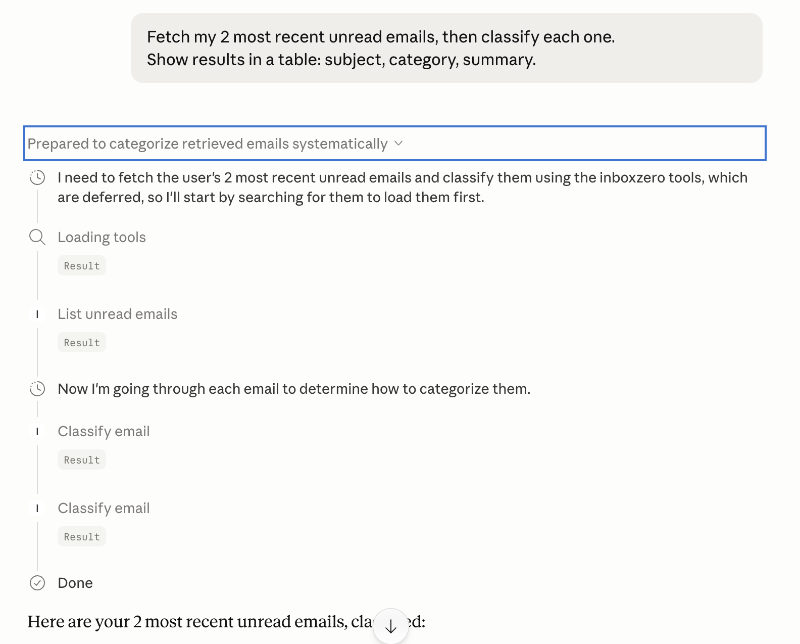

# Inbox Zero Agent（人工审核闭环）

[](https://github.com/scarlet-hu/InboxZero-Agent/actions/workflows/ci.yml)

> 🇬🇧 English version: [Readme.en.md](Readme.en.md)

🚀 **在线演示：** https://inboxzero-frontend.fly.dev/
> ⚠️ Backend 配置了 Fly.io `auto_stop_machines = 'stop'` 实现闲置零成本——空闲一段时间后的第一个请求会花 ~5–6 秒唤醒机器，后续请求恢复正常速度。

InboxZero 是一个智能邮件管理系统，用 AI 对 Gmail 收件箱里的邮件做分类、摘要和草稿生成，**所有草稿在发送前都需要人工审核**。

## 🏗️ 整体架构

```
┌──────────────────────┐         ┌──────────────────────────┐
│  Next.js (port 3000) │         │  FastAPI (port 8000)     │
│  - / 登录页          │ ──────▶ │  /auth/login → Google    │
│  - /dashboard        │ cookie  │  /auth/callback → JWT    │
│  - shadcn/ui + SWR   │ ◀────── │  /auth/me, /auth/logout  │
│                      │         │  /agent/process, /usage  │
└──────────────────────┘         └──────────┬───────────────┘
                                            │
                                            ▼
                                  ┌──────────────────────┐
                                  │  LangGraph agent     │
                                  │  categorize → check  │
                                  │  calendar → draft    │
                                  └──────────┬───────────┘
                                             │
                                             ▼
                                  ┌──────────────────────┐
                                  │  Gmail / Calendar    │
                                  │  / Gemini APIs       │
                                  └──────────────────────┘
```

## 🔌 MCP Server

InboxZero 把 Gmail 和 Calendar 工具以 **MCP server** 的形式暴露出来，
Claude Desktop、Cursor 等任意 MCP 兼容客户端都能直接调用——**不需要走 FastAPI 层**。



```bash
# 接入 Claude Desktop —— 加到 ~/Library/Application Support/Claude/claude_desktop_config.json
{
  "mcpServers": {
    "inboxzero": {
      "command": "/path/to/InboxZeroAgent/venv/bin/python",
      "args": ["/path/to/InboxZeroAgent/backend/mcp_server.py"]
    }
  }
}
```

**已暴露的工具：** `list_unread_emails` · `check_calendar_conflicts` · `classify_email`

---

**核心流程：**
1. **Fetch** → 通过 Gmail API 拉取未读邮件
2. **Categorize** → LangGraph 状态机 agent 分析并分类（action / fyi / spam）
3. **Context** → Calendar API 检查日程冲突
4. **Draft** → 为 action 邮件生成回复草稿
5. **Review** → 人工审批、编辑或丢弃草稿
6. **Send** → 经批准的邮件通过 Gmail API 发出

## 🛠️ 技术栈

### 后端
- **FastAPI** —— 高性能 REST API 框架
- **LangGraph** —— AI agent 工作流编排
- **LangChain** —— LLM 接入与 prompt 管理
- **Google Gemini 2.5 Flash** —— AI 语言模型（通过 `langchain-google-genai`）
- **Gmail API** —— 邮件拉取与草稿管理
- **Calendar API** —— 日程冲突检测
- **Python 3.x** —— 主语言

### 前端
- **Next.js 16**（App Router、TypeScript）
- **Tailwind CSS v4** + **shadcn/ui** 组件
- **SWR** —— 客户端数据获取

### 认证
- **OAuth 2.0** —— Google 认证流程
- **google-auth-oauthlib** —— OAuth 客户端库

### 开发
- **Uvicorn** —— ASGI 服务器
- **python-dotenv** —— 环境变量管理

## ✨ 核心功能

### ✅ 已实现
- [x] **多用户认证** —— OAuth 2.0 Google 登录 + 用户隔离
- [x] **邮件分类** —— AI 驱动的三分类：
  - `action` —— 需要邮件回复（直接提问、会议请求、任务分派）
  - `fyi` —— 仅供参考（自动化邮件、通知、收据）
  - `spam` —— 垃圾或无关邮件
- [x] **智能摘要** —— AI 生成的简洁邮件摘要
- [x] **日历集成** —— 自动检测日程冲突
- [x] **草稿生成** —— 为 action 邮件起草回复
- [x] **人工审核界面** —— Next.js 看板，在发送前审批 / 编辑 / 丢弃 agent 生成的草稿
  （review-approve HITL —— agent 跑完整个流程并使用 `no-auto-send` 模式；
  看板把编辑 / 发送 / 丢弃请求代理到 Gmail API）。
  这**不是**严格意义上的 workflow-interrupt HITL ——
  规划中的 `LangGraph interrupt + checkpointer` 变体（工作流本身在图中暂停）
  见 [docs/hitl-strong-design.md](docs/hitl-strong-design.md)。
- [x] **用量追踪** —— 每用户邮件处理限额
- [x] **LangGraph 状态机 Agent** —— 类型化 `AgentState` + 条件路由
  （为什么选状态机而不是 ReAct，详见 [docs/react-vs-state-machine.md](docs/react-vs-state-machine.md)）

### 🚧 开发中（WIP）
- [ ] **自动发送模式** —— 低风险邮件可选跳过人工审核
- [ ] **自定义类别** —— 用户自定义邮件分类规则
- [ ] **回复模板** —— 可复用的回复模板
- [ ] **邮件线程上下文** —— 用对话上下文生成更好的草稿
- [ ] **数据库集成** —— 持久化用量追踪与历史记录
- [ ] **批处理** —— 大收件箱的队列管理
- [ ] **分析看板** —— 邮件处理统计
- [ ] **多语言支持** —— 处理非英文邮件
- [ ] **GCP 部署** —— 部署到 Google Cloud Platform

### 📋 待办（Backlog）
- [ ] **优先级评分** —— 紧急邮件识别
- [ ] **附件处理** —— 解析附件并回复
- [ ] **会议时间建议** —— 根据空闲时段提议会议时间
- [ ] **邮件搜索** —— 在已处理邮件中搜索
- [ ] **Webhooks** —— 邮件到达时实时触发处理
- [ ] **浏览器插件** —— 直接从 Gmail UI 触发操作
- [ ] **移动 App** —— iOS / Android 审核界面
- [ ] **团队模式** —— 共享收件箱管理

## 📁 项目结构

```
InboxZeroAgent/
├── backend/
│   ├── app/
│   │   ├── main.py              # FastAPI 入口 + CORS
│   │   ├── models.py            # Pydantic 数据模型
│   │   ├── api/
│   │   │   ├── auth.py          # /auth/login, /callback, /me, /logout
│   │   │   └── endpoints.py     # /agent/process, /agent/usage
│   │   └── services/
│   │       ├── auth.py          # OAuth 流程、PKCE、JWT session
│   │       ├── agent_core.py    # LangGraph 状态机 agent（生产路径）
│   │       ├── agent_core_react.py  # ReAct 替代版 —— 详见 docs/react-vs-state-machine.md
│   │       └── google_utils.py  # Gmail / Calendar API 封装
│   ├── credentials.json         # Google OAuth client secrets
│   └── requirements.txt
├── web/                         # Next.js 16 + Tailwind + shadcn/ui
│   ├── src/app/                 #   /, /dashboard
│   ├── src/components/ui/       #   shadcn primitives
│   └── src/lib/                 #   api.ts, useUser.ts
├── eval/                        # 离线分类评估框架
├── tests/                       # pytest（后端）
├── Dockerfile.backend
├── web/Dockerfile               # Next.js 多阶段镜像
├── docker-compose.yml
└── Readme.md                    # 本文件
```

## 🚀 快速开始

### 前置依赖
- Python 3.8+
- 启用了 Gmail & Calendar API 的 Google Cloud 项目
- OAuth 2.0 凭据（`credentials.json`）

### 安装

1. **克隆仓库**
   ```bash
   git clone <repo-url>
   cd InboxZeroAgent
   ```

2. **创建虚拟环境**
   ```bash
   python -m venv venv
   source venv/bin/activate  # Windows: venv\Scripts\activate
   ```

3. **安装依赖**
   ```bash
   cd backend
   pip install -r requirements.txt
   ```

4. **配置环境变量**
   在 `backend/` 目录下创建 `.env`：
   ```env
   GOOGLE_API_KEY=your_gemini_api_key_here
   GOOGLE_CLIENT_ID=your_google_oauth_client_id
   GOOGLE_CLIENT_SECRET=your_google_oauth_client_secret
   ```

   OAuth callback 走后端，所以 Google Cloud Console 里的 redirect URI 必须指向 FastAPI：
   ```
   http://localhost:8000/auth/callback
   ```
   把这个 URI 同时加到 `backend/credentials.json` 的 `redirect_uris` 列表里。

5. **加入 Google OAuth 凭据**
   - 从 [Google Cloud Console](https://console.cloud.google.com/) 下载 `credentials.json`，
     放到 `backend/credentials.json`。

### 运行应用

**方式 A —— Docker Compose（推荐）**

```bash
docker compose up --build
```

- 后端：`http://localhost:8000`（Swagger 在 `/docs`）
- 前端：`http://localhost:3000`

**方式 B —— 本地开发（两个终端）**

终端 1 —— 后端：
```bash
cd backend && uvicorn app.main:app --reload
```

终端 2 —— 前端：
```bash
cd web && npm install && npm run dev
```

**登录流程**
1. 打开 `http://localhost:3000`，点击 "Sign in with Google"
2. 授权 Gmail + Calendar 权限
3. 跳转到 `/dashboard`
4. 选择要处理的邮件数量，点击 "Run Agent"
5. 审核分类结果 / 草稿

## 🧠 工作原理

### LangGraph 状态机 Agent

agent 是一个**确定性状态机**——分类结果决定每封邮件走哪条固定路径，
而不是让 LLM 在运行时自己选工具。曾经实现过 ReAct 替代版（`agent_core_react.py`）
并做了 benchmark，token 成本数据和"为什么生产版保留状态机"的分析
详见 [docs/react-vs-state-machine.md](docs/react-vs-state-machine.md)。

节点与状态：

```python
State: AgentState
├── email_id: str
├── sender: str
├── subject: str
├── email_content: str
├── category: "spam" | "fyi" | "action"
├── summary: str
├── calendar_status: Optional[str]
└── draft_id: Optional[str]

Nodes:
1. categorize_logic    → 用 Gemini LLM 分析邮件
2. calendar_check_logic → 检查日程冲突
3. draft_reply_logic   → 为 "action" 邮件生成回复
4. archive_logic       → 把 "fyi" 邮件标记为已读
```

**决策流程：**
- `spam` → 立即归档
- `fyi` → 摘要 + 归档
- `action` → 摘要 + 日历检查 + 草稿生成

### API 端点

#### `POST /agent/process`
处理 Gmail 收件箱中的未读邮件。

**Headers：**
- `X-User-Id`：用户标识

**Request Body：**
```json
{
  "credentials": "<base64_oauth_token>",
  "max_results": 10
}
```

**Response：**
```json
[
  {
    "subject": "Project Meeting Request",
    "sender": "colleague@company.com",
    "category": "action",
    "summary": "Requests meeting to discuss Q1 roadmap",
    "draft_id": "r-123456789",
    "calendar_status": "Available Tuesday 2-3pm"
  }
]
```

#### `GET /agent/usage`
获取用户的每日处理限额。

## 🧪 评估

分类质量在一个 30 条人工标注的数据集（10 action / 15 fyi / 5 spam）上评估，
覆盖了常见边缘 case，比如**自称 "action required" 的自动化告警**、
**礼品卡 / 钓鱼诈骗** 等。

```bash
set -a && source backend/.env && set +a
python eval/run_eval.py
```

报告（按类别 P/R/F1、混淆矩阵、延迟 p50/p95、错分清单）会写入 `eval/results/`。
完整流程（包括如何用 `--tag` 做 A/B prompt 测试）见 [`eval/Readme.md`](eval/Readme.md)。

## 🔐 安全注意事项

- OAuth token 本地存储在 `token.json`
- **绝对不要 commit** `credentials.json` 或 `.env`
- API key 用环境变量管理
- 所有草稿在发送前都要人工审核（human-in-the-loop）

## 📊 未来增强

- **向量数据库** —— 用 embedding 做语义邮件搜索
- **Fine-tuned 模型** —— 自定义邮件分类模型
- **A/B 测试** —— 不同 LLM 的草稿质量对比
- **企业功能** —— SSO、管理控制台、审计日志

## 🤝 贡献

欢迎贡献！请：
1. Fork 仓库
2. 创建 feature branch
3. 提交带测试的 PR

## 📄 许可证

MIT License

Copyright (c) 2026 Scarlett Hu

Permission is hereby granted, free of charge, to any person obtaining a copy
of this software and associated documentation files (the "Software"), to deal
in the Software without restriction, including without limitation the rights
to use, copy, modify, merge, publish, distribute, sublicense, and/or sell
copies of the Software, and to permit persons to whom the Software is
furnished to do so, subject to the following conditions:

The above copyright notice and this permission notice shall be included in all
copies or substantial portions of the Software.

THE SOFTWARE IS PROVIDED "AS IS", WITHOUT WARRANTY OF ANY KIND, EXPRESS OR
IMPLIED, INCLUDING BUT NOT LIMITED TO THE WARRANTIES OF MERCHANTABILITY,
FITNESS FOR A PARTICULAR PURPOSE AND NONINFRINGEMENT. IN NO EVENT SHALL THE
AUTHORS OR COPYRIGHT HOLDERS BE LIABLE FOR ANY CLAIM, DAMAGES OR OTHER
LIABILITY, WHETHER IN AN ACTION OF CONTRACT, TORT OR OTHERWISE, ARISING FROM,
OUT OF OR IN CONNECTION WITH THE SOFTWARE OR THE USE OR OTHER DEALINGS IN THE
SOFTWARE.


## 📞 支持

有问题请在 GitHub 上开 issue。

---

**状态：** Alpha —— 持续开发中 🚧
